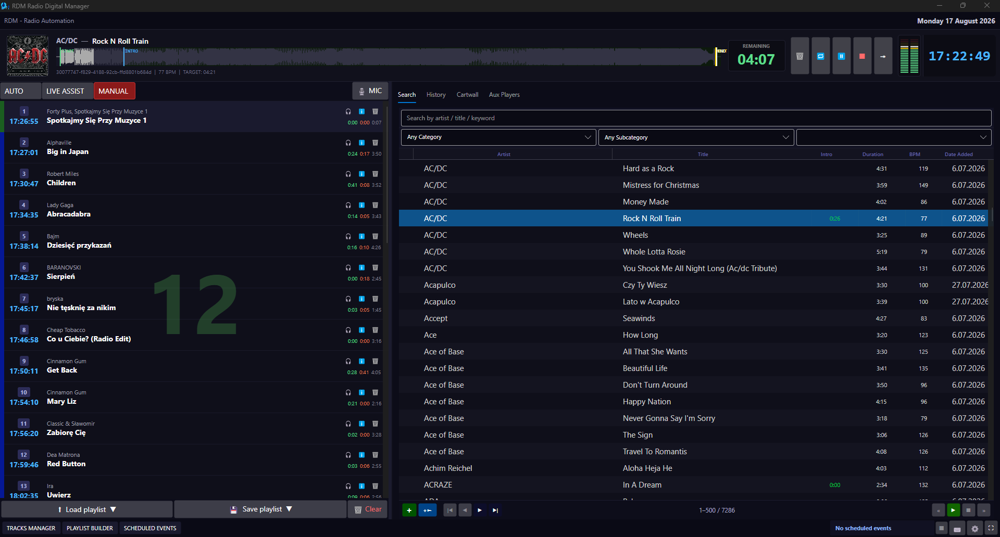

# RDM — Radio Digital Manager

<p align="center">
  🇬🇧 <strong>English</strong> | <a href="README_pl.md">🇵🇱 Polski</a>
</p>

<p align="center">
  
</p>

<p align="center">
  <strong>Radio Digital Manager</strong><br>
  An integrated environment for radio station operation and automation.
</p>

## About the Program

**RDM (Radio Digital Manager)** is a radio application that combines, in a single program, functions commonly found in several different tools used for radio production and broadcasting.

The goal of the project is to create a single, consistent environment for managing an audio library, preparing and playing playlists, using a cartwall, handling playout, streaming and microphone ducking, as well as performing other tasks related to day-to-day radio operations.

RDM is being developed as a modular project. Individual functions are gradually being integrated into a single interface instead of requiring the use of several independent programs.

Although the application is built using technology supported by Linux and macOS, it currently runs only on Windows 64-bit. 


### Current Project Status

The project is **actively developed**. Not all planned features are available yet.

In particular, **RDM does not yet have a scheduler responsible for automatically randomizing and creating playlists**. This feature is planned for a later stage of the project.

The [`screenshots`](screenshots/) folder contains screenshots showing the current appearance of the application and its individual available features.


## Main Features

Depending on the current stage of development, RDM includes or is developing, among others:

- audio playback and playout handling,
- audio library management,
- playlists,
- cartwall,
- Preview / AUX,
- microphone handling, including a VST effects chain,
- ducking during microphone operation,
- streaming,
- Cue points and track parameter handling,
- track editing and preparation for broadcast,
- multiple audio output handling,
- multi-user accounts with role-based access (Admin/Operator),
- database integration,
- a graphical user interface for the operator,
- an API enabling communication between application components.

> **Note:** The feature list will change as the project develops. Some components are currently only partially implemented or are still under development.
> 
> 

## Screenshots

The [`screenshots`](screenshots/) directory contains screenshots showing the application and its individual modules and features.

Images can be used directly in the project documentation, for example:

```markdown

```

## Technology Stack

- **.NET 10**
- **Avalonia UI** — user interface (`RDM.UI`)
- **ASP.NET Core Web API** — API (`RDM.API`)
- **MariaDB**
- **Dapper** — database access, without Entity Framework Core
- **BASS / Bass.Net** — audio engine

A full description of the architecture and solution projects can be found in [`ARCHITECTURE.md`](ARCHITECTURE.md).


## Project Structure

The main solution components are:

- `RDM.UI` — desktop application and user interface,
- `RDM.API` — Web API,
- `RDM.Core` — domain logic,
- `RDM.Audio` — audio engine handling,
- `RDM.Infrastructure` — infrastructure, database and repositories,
- `RDM.Shared` — shared models and components.
  
  

## Local Setup

### 1. Configuration

Copy the example configuration files and create their local equivalents:

```text
src/RDM.UI/rdm.config.example.json  →  src/RDM.UI/rdm.config.json
src/RDM.API/rdm.config.example.json →  src/RDM.API/rdm.config.json
```

Then fill in the `database` section with your MariaDB connection details:

- host,
- port,
- username,
- password,
- database name.

Files containing actual configuration data should not be added to the repository.


### 2. BASS Libraries

The `libs/` directory containing the native BASS libraries and `Bass.Net.dll` **is not included in the repository**.

The libraries must be downloaded directly from [un4seen.com](https://www.un4seen.com) and placed in the `libs/` directory.
The `Bass.Net.dll` wrapper must be placed in the application's root directory.


### 3. Integration Tests

The integration tests in `tests/RDM.Infrastructure.Tests` use a real MariaDB database.

The connection string must be provided through the following environment variable:

```text
RDM_TEST_DB_CONNECTION_STRING
```

If the variable is not set, a local placeholder is used, which will not work without a configured database.


## License and Audio Libraries

The RDM source code is released under the **MIT** license — see [`LICENSE`](LICENSE) for details.

RDM uses the **BASS** audio engine and the **Bass.Net** wrapper, developed by **un4seen developments**. These libraries **are not covered by the MIT license** and are subject to their own licensing terms.

BASS is free only for **non-commercial** use. Commercial use requires an appropriate license from un4seen.

The BASS libraries are not redistributed in this repository or in Releases. They must be downloaded directly from the vendor.


## Project Status

RDM is a project being developed in stages.

The current version focuses on building the core radio environment and integrating functions that would traditionally require several separate programs.

**The automatic scheduler for randomizing and creating playlists has not yet been implemented.**

Planned features will be added gradually as further modules are developed.

## Download

Current releases of the application are available in the Releases section:

**[Download RDM — Releases](https://github.com/remikaaa-uk/RDM-Radio-Automation/releases)**

---

## Documentation

- [`ARCHITECTURE.md`](ARCHITECTURE.md) — project architecture
- [`LICENSE`](LICENSE) — project license
- [`screenshots/`](screenshots/) — screenshots of the application and its features
